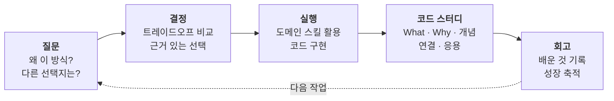
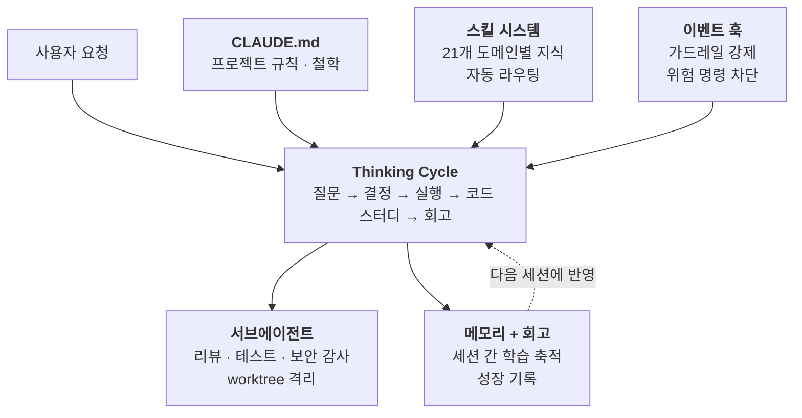

# ThinkFirst

> **"해줘" 엔터, "해줘" 엔터.
> 코드 설명하라면 "잠깐, GPT한테 물어볼게."
> 그렇게 만든 프로젝트, 진짜 내 실력인가?**

## 혹시 이런 적 없나요?

- AI가 짠 코드인데 한 줄도 설명 못하는 자신을 발견한 적
- "이거 왜 이렇게 했어?"라는 질문에 "AI가 해줬는데…"라고 말한 적
- 포트폴리오에 프로젝트는 있는데, 면접에서 아무것도 대답 못할까봐 불안한 적
- 이 속도로 AI가 발전하면 **내가 필요 없어지는 거 아닌가** 하는 생각이 스친 적

하나라도 해당된다면, 당신만 그런 게 아닙니다.

## 나도 그랬습니다

저도 대학생이고, AI와 함께 코딩합니다. 처음엔 좋았습니다. 빠르게 결과물이 나오고, 모르는 것도 바로 답이 나오니까. 그런데 어느 날 깨달았습니다 — **AI가 답을 줄수록 내 머릿속에는 아무것도 남지 않는다는 걸.**

코드는 완성되는데 성장은 멈춰 있었습니다. 이대로면 AI가 나를 대체하는 게 아니라, **이미 대체당하고 있는 거라는** 위기감이 들었습니다.

그래서 방향을 바꿨습니다. AI를 "대신 해주는 도구"가 아니라 **"생각하게 만드는 파트너"**로 바꾸기로 했습니다. 그 실험이 ThinkFirst입니다.

## ThinkFirst는 뭔가요?

Claude Code 위에서 동작하는 **사고 강제 에이전트 스킬 번들**입니다.

AI에게 작업을 시키면, 바로 실행하지 않습니다. 먼저 **질문**합니다. 왜 이 방식인지, 다른 선택지는 없는지, 트레이드오프는 뭔지. 당신이 생각하고 결정한 이후에야 실행합니다. 작업이 끝나면 **회고**를 통해 배운 것을 기록합니다.

**모든 작업에 질문 → 결정 → 실행 → 코드 스터디 → 회고 사이클을 적용합니다. 예외 없이.**



| Phase | 뭘 하는 건지 |
|-------|-------------|
| **질문** | AI가 바로 코드를 짜지 않습니다. "왜 이 방식이야?", "다른 방법은 생각해봤어?" — 먼저 당신의 사고를 촉발합니다. 답하기 전까지 실행하지 않습니다. |
| **결정** | 선택지가 있으면 AI가 각각의 장단점을 보여주고, 당신이 **이유와 함께** 결정합니다. "그냥 A"는 안 됩니다. "A, 왜냐하면..."을 요구합니다. |
| **실행** | 결정이 내려진 후에야 AI가 코드를 작성합니다. 작업 유형에 따라 적절한 도메인 스킬(backend, frontend, debug 등)이 자동으로 활성화됩니다. |
| **코드 스터디** | AI가 설명해주는 게 아닙니다. **당신이 직접 설명합니다.** "이 함수가 뭘 하는지 말해봐", "왜 이렇게 구현했어?" — 이해될 때까지 반복합니다. |
| **회고** | 이번 작업에서 뭘 배웠는지, 다음에 다르게 할 건 뭔지 직접 기록합니다. 이 기록이 파일로 쌓여서 성장의 증거가 됩니다. |

## 뭐가 다른가요?

### 일반 AI 코딩 도구

```
나: "로그인 API 만들어줘"
AI: (바로 코드 생성)
    "완성했습니다. JWT 기반 인증이고, bcrypt로 해싱했습니다."
나: "ㅇㅋ"
```

결과: 코드는 있다. 왜 JWT인지, bcrypt가 뭔지, 세션 방식과 뭐가 다른지 모른다.

### ThinkFirst

```
나: "로그인 API 만들어줘"
AI: "로그인 구현 전에 몇 가지 짚어볼게요.
     인증 방식을 JWT로 갈지, 세션으로 갈지 — 각각의 트레이드오프를 알고 계신가요?
     이 프로젝트에서 어떤 방식이 더 맞을지, 이유와 함께 골라주세요."
나: (생각한다. 찾아본다. 비교한다. 결정한다.)
AI: (결정에 따라 실행. 완료 후 변경 코드를 함께 분석하고 회고.)
```

결과: 코드도 있고, **왜 이 구조인지 설명할 수 있다.**

## 이게 왜 중요한가 — 복리 효과

CS 지식, 코드 리딩 능력, 설계 판단력. 이것들은 따로 노는 게 아닙니다.

```
CS 기초 → 코드가 왜 이렇게 동작하는지 이해
         → 코드 리딩 능력 향상
         → 설계 판단력 성장
         → 더 좋은 질문, 더 좋은 결정
         → 다시 더 깊은 CS 이해
         → (반복 — 복리처럼 가속)
```

ThinkFirst는 프로젝트를 진행하면서 이 사이클을 **매번 강제로 돌립니다.** 한 번의 작업에서 코드만 나오는 게 아니라, 지식과 판단력이 함께 쌓입니다. 시간이 지날수록 같은 시간에 더 많이 배우고, 더 나은 결정을 내릴 수 있게 됩니다.

**AI에 대체되는 개발자와 AI를 활용하는 개발자의 차이는, 이 사이클을 돌렸느냐 아니냐에 있습니다.**

## 구성 요소

| 구분 | 내용 |
|------|------|
| **21개 스킬** | backend, frontend, debug, qa, commit 등 — 작업 맥락에 따라 자동 활성화 |
| **5개 서브에이전트** | 코드 리뷰, 테스트, 보안 감사를 worktree 격리 환경에서 자동 위임 |
| **10개 이벤트 훅** | 위험 명령 차단, 자동 포매팅, 보안 변경 감지, 컨텍스트 보존 등 |
| **Thinking Cycle** | 질문 → 결정 → 실행 → 코드 스터디 → 회고. 모든 작업에 자동 적용 |
| **회고 시스템** | 작업 완료 후 배운 것을 기록하고 축적. 성장의 증거가 쌓인다 |

## 왜 이렇게까지 만들었나 — 컨텍스트 엔지니어링

"AI한테 '생각하고 질문해'라고 시키면 되지 않아?"

처음엔 저도 그렇게 생각했습니다. 프롬프트 하나에 "실행 전에 질문해, 회고해"라고 적었습니다. 처음 몇 번은 작동했습니다. 그런데 금방 한계가 보였습니다.

### 프롬프트 하나로는 안 되는 이유

- **맥락이 사라진다**: 새 대화를 시작하면 AI는 어제 뭘 배웠는지 모릅니다. 매번 처음부터 다시 설명해야 합니다.
- **일관성이 없다**: 같은 프롬프트인데 어떤 날은 깊이 질문하고, 어떤 날은 형식적으로 넘어갑니다. 작업이 복잡해지면 사고 사이클을 슬쩍 건너뜁니다.
- **도메인마다 다른 맥락이 필요하다**: 백엔드 작업에서는 아키텍처 질문이, 디버깅에서는 재현 전략이 필요한데, 하나의 프롬프트로 모든 상황을 커버할 수 없습니다.
- **가드레일이 없다**: "위험한 명령 쓰지 마"라고 적어도, 강제하는 메커니즘이 없으면 무시됩니다.

### 그래서 시스템을 만들었습니다

단순히 "이렇게 해"라는 지시가 아니라, **AI가 올바른 맥락 안에서 동작하도록 환경 자체를 설계**했습니다. 이것이 컨텍스트 엔지니어링입니다.



각 구성요소가 하는 일:

- **CLAUDE.md** — 프로젝트의 규칙과 철학이 적힌 설정 파일입니다. AI가 매 대화 시작 시 자동으로 읽어서, 어떤 세션에서든 일관된 행동을 유지합니다.
- **스킬 시스템** — "API 만들어줘"라고 하면 backend 스킬이, "버그 고쳐줘"라고 하면 debug 스킬이 자동 로드됩니다. 각 스킬에는 해당 도메인에 맞는 질문 패턴, 실행 규칙, 체크리스트가 들어 있습니다.
- **이벤트 훅** — `git push --force` 같은 위험한 명령을 AI가 실행하려 하면 코드 레벨에서 자동 차단합니다. 프롬프트에 "하지 마"라고 적는 것과는 강제력이 다릅니다.
- **서브에이전트** — AI가 코드를 작성하면, 별도의 AI 에이전트가 격리된 환경에서 코드 리뷰, 테스트, 보안 검사를 자동 수행합니다.
- **메모리 + 회고** — 오늘 배운 것이 파일로 저장되어 다음 세션에 자동 반영됩니다. AI가 "지난번에 이런 피드백이 있었으니 이번에는..."이라고 맥락을 이어갈 수 있는 이유입니다.

| 문제 | 해결 |
|------|------|
| 맥락이 매번 사라진다 | **메모리 + 회고 시스템** — 세션 간 학습이 파일로 축적되고, 회고가 다음 작업의 기반이 된다 |
| 사고 사이클이 형식적으로 흐른다 | **스킬 계층 구조** — 공유 리소스 → 도메인별 프로토콜 → 실행 절차로 단계별 구체화. 건너뛸 수 없다 |
| 도메인마다 다른 지식이 필요하다 | **자동 스킬 라우팅** — 작업 유형을 감지하여 해당 도메인의 지식과 규칙을 자동 로드 |
| 가드레일이 강제되지 않는다 | **이벤트 훅** — 위험 명령 차단, 보안 변경 감지, 자동 포매팅이 코드 레벨에서 실행된다 |
| AI 혼자 모든 걸 하면 품질이 떨어진다 | **서브에이전트 위임** — 리뷰, 테스트, 보안 감사를 격리된 환경에서 별도 에이전트가 수행 |

### 사고 강제 × 컨텍스트 엔지니어링

ThinkFirst의 핵심은 이 두 가지의 결합입니다.

- **사고 강제**: 사용자가 생각하고 결정하게 만드는 사이클
- **컨텍스트 엔지니어링**: AI가 그 사이클을 일관되게 돌릴 수 있는 환경

프롬프트는 "뭘 하라"는 지시입니다. 컨텍스트 엔지니어링은 **"어떤 환경에서 동작하라"는 설계**입니다. 지시는 무시할 수 있지만, 환경은 무시할 수 없습니다.

## 설치

### 스크립트 설치 (권장)

```bash
git clone https://github.com/Siul49/think-first.git
bash think-first/scripts/install.sh /path/to/your-project --claude --with-config
```

### 수동 설치

```bash
git clone https://github.com/Siul49/think-first.git
cp -r think-first/.claude/skills/ your-project/.claude/skills/
cp -r think-first/.claude/agents/ your-project/.claude/agents/
cp -r think-first/.claude/hooks/ your-project/.claude/hooks/
cp think-first/.claude/settings.json your-project/.claude/settings.json
```

### 설치 후

1. `CLAUDE.md`를 프로젝트에 맞게 수정 (호칭, 문체, Co-Authored-By 등)
2. 불필요한 스킬 디렉토리 삭제 (예: 모바일 미사용 시 `mobile/` 삭제)
3. `manage-skills` 스킬로 프로젝트에 맞는 검증 스킬 생성

## 업데이트

```bash
cd think-first && git pull
bash scripts/install.sh /path/to/your-project --claude
```

스킬/에이전트/훅만 덮어쓰고 `CLAUDE.md`는 건드리지 않습니다.

## 프로젝트 구조

```
.claude/
├── skills/              # 스킬 정의 (SKILL.md + resources/)
├── skills/_shared/      # 공유 리소스 (Thinking Cycle, 추론 템플릿)
├── agents/              # 서브에이전트 (자동 위임, worktree 격리)
├── hooks/               # 이벤트 Hook 스크립트
├── reflections/         # 회고 기록 (날짜별)
├── settings.json        # Hook 등록, 권한 설정
└── context/             # 복합 작업 문서 (런타임)
```

## 기여

이 프로젝트는 아직 실험 중입니다. 좋은 의견이 있다면 듣고 생각하고 반영할 생각입니다.

- 이슈와 PR을 환영합니다
- Conventional Commits 형식으로 커밋
- 한국어 문서 기본 (식별자, 명령어는 영어 유지)
- 새 스킬 추가 시 `SKILL.md` + `resources/` 구조 준수

## 라이선스

[Apache License 2.0](LICENSE)
